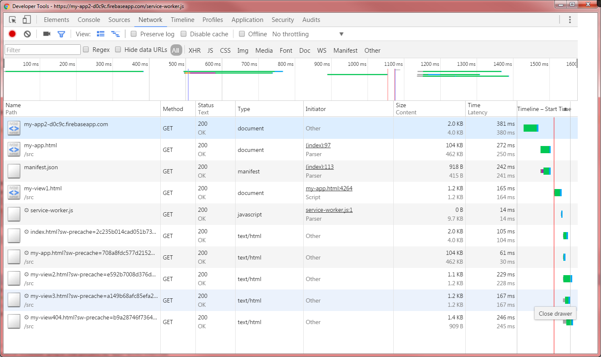
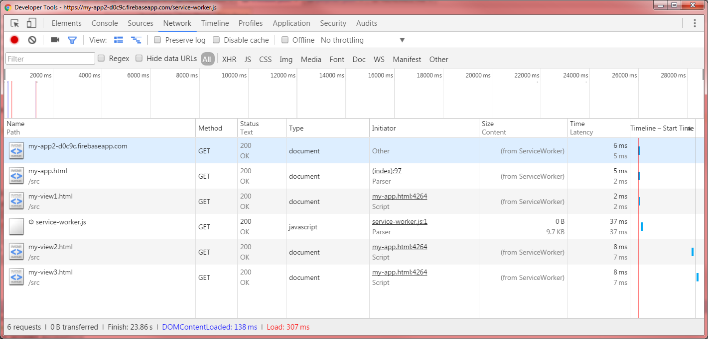
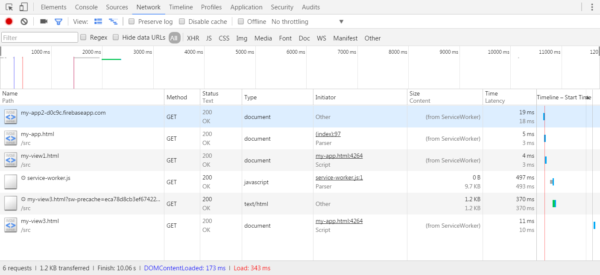
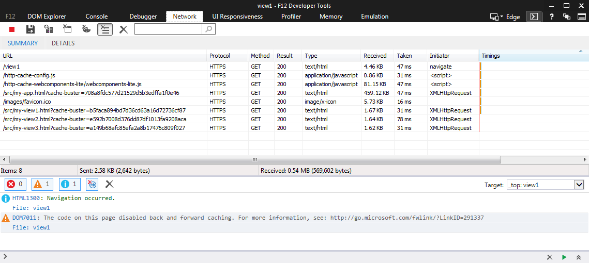
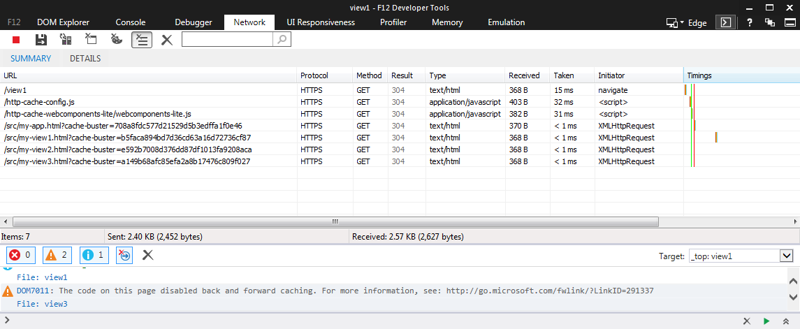
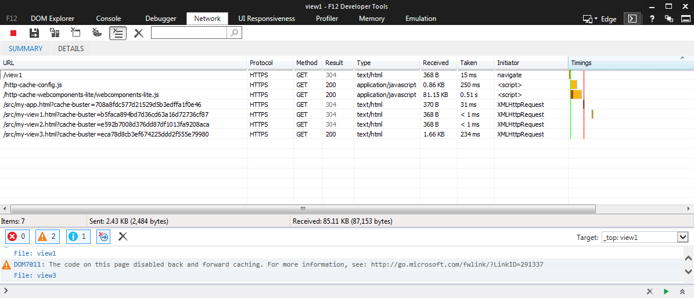

#Goal 
- Configure the polymer app in this repo to use service worker if its available or browser cache otherwise. 
- If any component of the app changes entrypoint/shell/fragments, the component should get updated automatically 
once the app is deployed and the component is accessed. This should happen without clearing the browser 
cache manually.

#Deployed app 
The demo app is [here](https://my-app2-d0c9c.firebaseapp.com/). Firebase was used for deployment. 
The firebase.json has been configured to support browser caching and service worker caching. 

#Details

See images below for the different app access in a browser supporting service worker (chrome) and in IE11. 
>Note: The service worker in FF works as it does in chrome. 

All images are taken after accessing the first view and clicking on the other view links.

##Service Worker

###Initial visit


- Once the app is accessed, the service worker downloads all the views immediately.
- server-worker.js Cache-Control is set in firebase.json with "no-cache, no-store, max-age=0, must-revalidate" . 

###Subsequent visits and clicking on other views


All views are served from the ServiceWorker cache.


###Modify view3 and visit the site


- After Modifying view3, build and deploy. 
- The app was accessed and view1 was displayed initially. The new service worker downloads view3 immediately. After 
clicking on view3, the new changed view3 gets displayed. 
- If view1 was changed instead and it was accessed initially, the new changes will not be visible until it gets 
accessed for the second time. Not until the new service worker is active.

##Browser Cache

###Initial visit


- When no service worker is available, the http-cache-config.js gets downloaded by index.html.
```javascript
        if ('serviceWorker' in navigator) {
          window.addEventListener('load', function() {
            navigator.serviceWorker.register('/service-worker.js');
          });
        } else {
          var e = document.createElement('script');
          e.src = '/http-cache-config.js';
          document.head.appendChild(e);
        }
```

- http-cache-config.js gets generated by the build and configured just like service-worker.js with 
"no-cache, no-store, max-age=0, must-revalidate" 
- The http-cache-config.js (just like the service-worker.js) has an array of the components URIs and their content
 hash. 
- Use the file fingerprint to bust the cache by appending the request param cache-buster.  

 Sample of the http-cache-config.js
```javascript
  'use strict';
  var HTTPCacheConfig = [
  ["/index.html","2c235b014cad051b73ebcee498d2f547"],
  ["/src/my-app.html","708a8fdc577d21529d5b3edffa1f0e46"],
  ["/src/my-view1.html","b5faca894bd7d36cd63a16d72736cf87"],
  ["/src/my-view2.html","e592b7008d376dd87df1013fa9208aca"],
  ["/src/my-view3.html","a149b68afc85efa2a8b17476c809f027"],
  ["/src/my-view404.html","b9a28746f736435f74b42f65b65b4eac"]];
```

- The cache-buster request param is used only if the global variable HTTPCacheConfig is available.
- A modified version of webcomponents-lite.js in this repo checks if this variable is available and it appends the 
request param.

```javascript

load: function(url, next, nextContext) {
  var request = new XMLHttpRequest();
  if (scope.flags.debug || scope.flags.bust) {
      url += "?" + Math.random();
  } else {
      var cacheRequestParam = this._getCacheRequestParam(url);
      if (cacheRequestParam) {
        url += "?cache-buster=" + cacheRequestParam;
      }
   }
   request.open("GET", url, xhr.async);

```

- webcomponents.js already had code to bust the cache if the bust flag is set.
- All views are downloaded on the first time they are accessed.

> Note: If you have IE11 debugger opened, make sure to uncheck the "always refresh from server" in the network tab.
 
###Subsequent visits and clicking on other views


The views are retrieved from the browser cache

###Modify view3 and visit the site


New view3 gets downloaded

#Building
npm install
bower install
gulp
firebase deploy

See polymer documentation on how to deploy to firebase.
